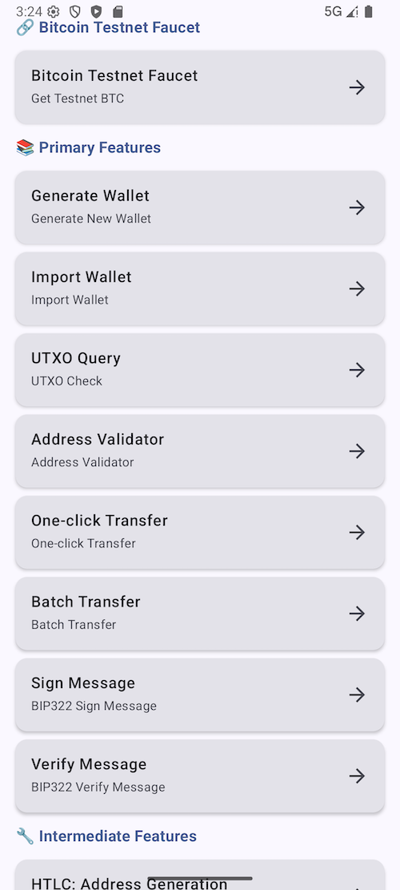

# BitcoinKotlin
**BitcoinKotlin** is an Android toolbelt for interaction with the BTC network.




For more specific usage, please refer to the [demo](https://github.com/Marcos-cmyk/BitcoinKotlin/tree/main/app)

# Bitcoin Android Library

A feature-complete Android Bitcoin operations library supporting wallet management, transactions, HTLC, multisig, and other advanced features. Built with Kotlin and Coroutines, providing a clean async/await API.

## ✨ Features

### 🔐 Wallet Management
- ✅ Generate wallet (supports multiple mnemonic lengths and languages)
- ✅ Import wallet from mnemonic
- ✅ Import wallet from private key
- ✅ Support for Legacy (P2PKH), Segwit (P2WPKH), and Taproot (P2TR) addresses

### 💸 Transaction Features
- ✅ One-click transfer (automatically queries UTXO, estimates fees, signs and broadcasts)
- ✅ Batch transfer (one-to-many)
- ✅ UTXO query
- ✅ Fee estimation (supports different priorities and address types)

### 🔒 Advanced Features
- ✅ **HTLC (Hash Time Lock Contract)**
    - Generate HTLC address
    - Unlock HTLC address and transfer
- ✅ **No-Signature Script**
    - Generate no-signature script address (time lock + hash lock)
    - Unlock no-signature script address (no private key required, only preimage needed)
- ✅ **Multisig Address**
    - Generate multisig address (P2SH/P2WSH)
    - Execute multisig transfer

### 📝 Message Signing
- ✅ BIP322 message signing
- ✅ Message verification

### 🌐 Network Support
- ✅ Mainnet
- ✅ Testnet

## 📦 Installation

### 1. Add JitPack Repository

Add the following to your project root `settings.gradle.kts`:

```kotlin
dependencyResolutionManagement {
    repositoriesMode.set(RepositoriesMode.FAIL_ON_PROJECT_REPOS)
    repositories {
        google()
        mavenCentral()
        maven { url = uri("https://jitpack.io") }  // Add JitPack repository
    }
}
```

### 2. Add Dependency

Add the following to your `build.gradle.kts` (Module: app):

```kotlin
dependencies {
   implementation("com.github.Marcos-cmyk:BitcoinKotlin:1.0.5")
}
```

**Note**: 
- Replace `TAG` with your release tag (e.g., `1.0.4`, `v1.0.4`)
- Since `bitcoin` is a submodule, the format is: `com.github.用户名:仓库名:模块名:版本号`
- You can check available versions on [JitPack](https://jitpack.io/#Marcos-cmyk/BitcoinKotlin)

## 🚀 Quick Start

### 1. Initialize Library

```kotlin
import com.marcos.bitcoin.BitcoinV1

class MainActivity : AppCompatActivity() {
    private lateinit var bitcoin: BitcoinV1
    
    override fun onCreate(savedInstanceState: Bundle?) {
        super.onCreate(savedInstanceState)
        
        // Create BitcoinV1 instance
        bitcoin = BitcoinV1(this)
        
        // Initialize library
        bitcoin.setup(showLog = true) { success ->
            if (success) {
                Log.d("Bitcoin", "Library initialized successfully")
            } else {
                Log.e("Bitcoin", "Library initialization failed")
            }
        }
    }
}
```

### 2. Generate Wallet

```kotlin
import kotlinx.coroutines.launch

// Using Coroutines (Recommended)
lifecycleScope.launch {
    val (success, wallet, error) = bitcoin.createAccount(
        mnemonicLength = 128,  // 12 words
        isTestnet = true,
        language = "english"
    )
    
    if (success && wallet != null) {
        Log.d("Wallet", "Mnemonic: ${wallet.mnemonic}")
        Log.d("Wallet", "Private Key: ${wallet.privateKey}")
        Log.d("Wallet", "Segwit Address: ${wallet.addresses.segwit}")
    } else {
        Log.e("Wallet", "Error: $error")
    }
}

// Or using callback
bitcoin.createAccount(
    mnemonicLength = 128,
    isTestnet = true,
    language = "english"
) { success, wallet, error ->
    if (success && wallet != null) {
        // Use wallet information
    }
}
```

### 3. Import Wallet

```kotlin
// Import from mnemonic
lifecycleScope.launch {
    val (success, wallet, error) = bitcoin.importAccountFromMnemonic(
        mnemonic = "abandon abandon abandon abandon abandon abandon abandon abandon abandon abandon abandon about",
        isTestnet = true
    )
}

// Import from private key
lifecycleScope.launch {
    val (success, wallet, error) = bitcoin.importAccountFromPrivateKey(
        privKeyHex = "your_private_key_hex",
        isTestnet = true
    )
}
```

### 4. One-Click Transfer

```kotlin
lifecycleScope.launch {
    val (success, result, error) = bitcoin.oneClickTransfer(
        privKeyHex = "your_private_key_hex",
        toAddress = "bc1q...",
        amountSats = 100000,  // 0.001 BTC
        feeSats = 3000,
        isTestnet = true
    )
    
    if (success && result != null) {
        Log.d("Transfer", "TXID: ${result.txid}")
        Log.d("Transfer", "Signed Hex: ${result.signedHex}")
    }
}
```

## 📚 API Documentation

### Wallet Management

#### `createAccount`
Generate a new wallet account.

```kotlin
suspend fun createAccount(
    mnemonicLength: Int = 128,      // Mnemonic length: 128(12 words)/160(15 words)/192(18 words)/224(21 words)/256(24 words)
    isTestnet: Boolean = true,      // Whether to use testnet
    language: String = "english"     // Mnemonic language
): Triple<Boolean, BitcoinWallet?, String?>
```

**Returns**: `(success: Boolean, wallet: BitcoinWallet?, error: String?)`

**Supported mnemonic languages**:
- `english` (default)
- `chinese_simplified`
- `chinese_traditional`
- `korean`
- `japanese`
- `french`
- `italian`
- `spanish`
- `czech`
- `portuguese`

#### `importAccountFromMnemonic`
Import wallet from mnemonic.

```kotlin
suspend fun importAccountFromMnemonic(
    mnemonic: String,               // Mnemonic string
    isTestnet: Boolean = true,      // Whether to use testnet
    language: String? = null        // Optional: mnemonic language
): Triple<Boolean, BitcoinWallet?, String?>
```

#### `importAccountFromPrivateKey`
Import wallet from private key.

```kotlin
suspend fun importAccountFromPrivateKey(
    privKeyHex: String,             // Private key (HEX format)
    isTestnet: Boolean = true       // Whether to use testnet
): Triple<Boolean, BitcoinWallet?, String?>
```

### Address Validation

#### `validateAddress`
Validate Bitcoin address validity.

```kotlin
suspend fun validateAddress(
    address: String                 // Address to validate
): Triple<Boolean, AddressValidationResult?, String?>
```

**Returns**: `AddressValidationResult` contains:
- `isValid: Boolean` - Whether the address is valid
- `network: String` - Network type ("mainnet" or "testnet")
- `addressType: String` - Address type ("legacy", "segwit", "taproot")

### Transaction Features

#### `oneClickTransfer`
One-click transfer (automatically queries UTXO, signs and broadcasts).

```kotlin
suspend fun oneClickTransfer(
    privKeyHex: String,             // Private key (HEX format)
    toAddress: String,              // Recipient address
    amountSats: Long,               // Transfer amount (satoshis)
    feeSats: Long,                 // Transaction fee (satoshis)
    isTestnet: Boolean = true,      // Whether to use testnet
    fromAddress: String? = null    // Optional: sender address (default derived from private key)
): Triple<Boolean, OneClickTransferResult?, String?>
```

#### `batchTransfer`
Batch transfer (one-to-many).

```kotlin
suspend fun batchTransfer(
    privKeyHex: String,             // Private key (HEX format)
    recipients: List<Pair<String, Long>>,  // Recipient list [(address, amount(satoshis))]
    feeSats: Long,                 // Total transaction fee (satoshis)
    isTestnet: Boolean = true,      // Whether to use testnet
    fromAddress: String? = null    // Optional: sender address
): Triple<Boolean, BatchTransferResult?, String?>
```

**Example**:
```kotlin
val recipients = listOf(
    "bc1q..." to 50000L,   // 0.0005 BTC
    "bc1q..." to 30000L    // 0.0003 BTC
)

val (success, result, error) = bitcoin.batchTransfer(
    privKeyHex = "your_private_key",
    recipients = recipients,
    feeSats = 3000,
    isTestnet = true
)
```

#### `queryUTXO`
Query UTXO list for an address.

```kotlin
suspend fun queryUTXO(
    address: String,                // Address to query
    isTestnet: Boolean = true       // Whether to use testnet
): Triple<Boolean, List<UTXOInfo>?, String?>
```

**Returns**: `List<UTXOInfo>`, each `UTXOInfo` contains:
- `txHash: String` - Transaction hash
- `index: Int` - Output index
- `value: Long` - Amount (satoshis)
- `valueInBTC: Double` - Amount (BTC)

#### `estimateFee`
Estimate transaction fee.

```kotlin
suspend fun estimateFee(
    inputsCount: Int = 1,           // Number of inputs
    outputsCount: Int = 2,          // Number of outputs
    isTestnet: Boolean = true,      // Whether to use testnet
    addressType: String = "segwit", // Address type: legacy/segwit/taproot/multisig
    n: Int = 1,                     // Multisig threshold (multisig only)
    m: Int = 1                      // Multisig total (multisig only)
): Triple<Boolean, FeeEstimateResult?, String?>
```

**Returns**: `FeeEstimateResult` contains:
- `high: Long` - High priority fee (satoshis)
- `medium: Long` - Medium priority fee (satoshis)
- `low: Long` - Low priority fee (satoshis)
- `size: Int` - Estimated transaction size (vBytes)

### HTLC (Hash Time Lock Contract)

#### `generateHtlcAddress`
Generate HTLC address.

```kotlin
suspend fun generateHtlcAddress(
    pubKeyHex: String,              // Public key (HEX format)
    lockHeight: Int,                // Lock height
    secretHex: String,              // Secret preimage (HEX format)
    isTestnet: Boolean = true       // Whether to use testnet
): Triple<Boolean, HTLCAddressResult?, String?>
```

**Returns**: `HTLCAddressResult` contains:
- `address: String` - HTLC address
- `redeemScript: String` - Redeem script
- `lockHeight: Int` - Lock height
- `secretHex: String` - Secret preimage

#### `unlockHtlcAddress`
Unlock HTLC address and transfer.

```kotlin
suspend fun unlockHtlcAddress(
    htlcAddress: String,            // HTLC source address
    toAddress: String,              // Recipient address
    amountSats: Long,               // Transfer amount (satoshis)
    feeSats: Long,                 // Transaction fee (satoshis)
    privKeyHex: String,             // Private key (HEX format)
    lockHeight: Int,                // Lock height
    secretHex: String,              // Secret preimage (HEX format)
    redeemScript: String,           // Redeem script (HEX format)
    isTestnet: Boolean = true       // Whether to use testnet
): Triple<Boolean, HTLCUnlockResult?, String?>
```

### No-Signature Script

#### `generateNoSigScriptAddress`
Generate no-signature script address (time lock + hash lock, no signature required).

```kotlin
suspend fun generateNoSigScriptAddress(
    lockHeight: Int,                // Lock height
    secretHex: String,              // Secret preimage (HEX format)
    isTestnet: Boolean = true       // Whether to use testnet
): Triple<Boolean, HTLCAddressResult?, String?>
```

**Note**: No-signature script addresses have security risks, use with caution.

#### `unlockNoSigScriptAddress`
Unlock no-signature script address and transfer (no private key required, only preimage needed).

```kotlin
suspend fun unlockNoSigScriptAddress(
    noSigAddress: String,           // No-signature script source address
    toAddress: String,              // Recipient address
    amountSats: Long,               // Transfer amount (satoshis)
    feeSats: Long,                 // Transaction fee (satoshis)
    lockHeight: Int,                // Lock height
    secretHex: String,              // Secret preimage (HEX format)
    redeemScript: String,           // Redeem script (HEX format)
    isTestnet: Boolean = true,      // Whether to use testnet
    changeAddress: String? = null   // Optional: change address (recommended to provide)
): Triple<Boolean, HTLCUnlockResult?, String?>
```

**Important Notes**:
- If change amount ≥ 546 sats, it is recommended to provide the `changeAddress` parameter
- Change address cannot be the same as source address (will be locked again)
- Change address should be a regular address controlled by the user (P2PKH, P2WPKH, or P2TR)

### Multisig Address

#### `generateMultisigAddress`
Generate multisig address (P2SH/P2WSH).

```kotlin
suspend fun generateMultisigAddress(
    threshold: Int,                 // Threshold (N in N-of-M)
    pubkeys: List<String>,          // Public key list
    isTestnet: Boolean = true       // Whether to use testnet
): Triple<Boolean, MultisigAddressResult?, String?>
```

**Returns**: `MultisigAddressResult` contains:
- `script: String` - Multisig script
- `p2shAddress: String` - P2SH address (Legacy)
- `p2wshAddress: String` - P2WSH address (Segwit)
- `threshold: Int` - Threshold
- `totalSigners: Int` - Total number of signers

#### `sendMultisigTransaction`
Execute multisig transfer.

```kotlin
suspend fun sendMultisigTransaction(
    multisigAddress: String,        // Multisig address
    toAddress: String,              // Recipient address
    amountSats: Long,               // Transfer amount (satoshis)
    feeSats: Long,                 // Transaction fee (satoshis)
    allPubkeys: List<String>,       // All participant public keys (order must be correct)
    signPrivKeys: List<String>,     // Signing private key list (must meet threshold requirement)
    isTestnet: Boolean = true       // Whether to use testnet
): Triple<Boolean, MultisigTransferResult?, String?>
```

### Message Signing

#### `signMessage`
Sign message (BIP322).

```kotlin
suspend fun signMessage(
    message: String,                // Message to sign
    privKeyHex: String,             // Private key (HEX format)
    addressType: String = "segwit", // Address type: legacy/segwit/taproot
    isTestnet: Boolean = true       // Whether to use testnet
): Triple<Boolean, String?, String?>
```

**Returns**: `(success: Boolean, address: String?, signature: String?)`

#### `verifyMessage`
Verify message signature.

```kotlin
suspend fun verifyMessage(
    message: String,                // Original message
    signature: String,              // Signature
    address: String,                // Address
    isTestnet: Boolean = true       // Whether to use testnet
): Triple<Boolean, Boolean?, String?>
```

**Returns**: `(success: Boolean, isValid: Boolean?, error: String?)`

## 📖 Usage Examples

### Complete Example: Create Wallet and Transfer

```kotlin
import com.marcos.bitcoin.BitcoinV1
import kotlinx.coroutines.launch

class MainActivity : AppCompatActivity() {
    private lateinit var bitcoin: BitcoinV1
    
    override fun onCreate(savedInstanceState: Bundle?) {
        super.onCreate(savedInstanceState)
        
        bitcoin = BitcoinV1(this)
        bitcoin.setup(showLog = true) { success ->
            if (success) {
                performWalletOperations()
            }
        }
    }
    
    private fun performWalletOperations() {
        lifecycleScope.launch {
            // 1. Generate wallet
            val (success1, wallet, error1) = bitcoin.createAccount(
                mnemonicLength = 128,
                isTestnet = true
            )
            
            if (!success1 || wallet == null) {
                Log.e("Wallet", "Failed to create wallet: $error1")
                return@launch
            }
            
            Log.d("Wallet", "Created wallet: ${wallet.addresses.segwit}")
            
            // 2. Query balance
            val (success2, utxos, error2) = bitcoin.queryUTXO(
                address = wallet.addresses.segwit,
                isTestnet = true
            )
            
            if (success2 && utxos != null) {
                val totalBalance = utxos.sumOf { it.value }
                Log.d("Balance", "Total balance: ${totalBalance / 100_000_000.0} BTC")
            }
            
            // 3. Estimate fee
            val (success3, feeEstimate, error3) = bitcoin.estimateFee(
                inputsCount = 1,
                outputsCount = 2,
                isTestnet = true,
                addressType = "segwit"
            )
            
            if (success3 && feeEstimate != null) {
                Log.d("Fee", "Medium fee: ${feeEstimate.medium} sats")
                
                // 4. Execute transfer
                val (success4, result, error4) = bitcoin.oneClickTransfer(
                    privKeyHex = wallet.privateKey,
                    toAddress = "tb1q...",
                    amountSats = 100000,  // 0.001 BTC
                    feeSats = feeEstimate.medium,
                    isTestnet = true
                )
                
                if (success4 && result != null) {
                    Log.d("Transfer", "Transaction sent! TXID: ${result.txid}")
                }
            }
        }
    }
}
```

### HTLC Example

```kotlin
lifecycleScope.launch {
    // 1. Generate HTLC address
    val (success1, htlcResult, error1) = bitcoin.generateHtlcAddress(
        pubKeyHex = "your_public_key_hex",
        lockHeight = 2542622,
        secretHex = "6d79536563726574",
        isTestnet = true
    )
    
    if (success1 && htlcResult != null) {
        Log.d("HTLC", "HTLC Address: ${htlcResult.address}")
        Log.d("HTLC", "Redeem Script: ${htlcResult.redeemScript}")
        
        // 2. Unlock HTLC (requires private key and preimage)
        val (success2, unlockResult, error2) = bitcoin.unlockHtlcAddress(
            htlcAddress = htlcResult.address,
            toAddress = "tb1q...",
            amountSats = 100000,
            feeSats = 3000,
            privKeyHex = "your_private_key_hex",
            lockHeight = htlcResult.lockHeight,
            secretHex = htlcResult.secretHex,
            redeemScript = htlcResult.redeemScript,
            isTestnet = true
        )
        
        if (success2 && unlockResult != null) {
            Log.d("HTLC", "Unlocked! TXID: ${unlockResult.txid}")
        }
    }
}
```

### Multisig Example

```kotlin
lifecycleScope.launch {
    // 1. Generate multisig address (2-of-3)
    val pubkeys = listOf(
        "pubkey1_hex",
        "pubkey2_hex",
        "pubkey3_hex"
    )
    
    val (success1, multisigResult, error1) = bitcoin.generateMultisigAddress(
        threshold = 2,
        pubkeys = pubkeys,
        isTestnet = true
    )
    
    if (success1 && multisigResult != null) {
        Log.d("Multisig", "P2WSH Address: ${multisigResult.p2wshAddress}")
        
        // 2. Execute multisig transfer (requires 2 private key signatures)
        val signPrivKeys = listOf(
            "privkey1_hex",
            "privkey2_hex"
        )
        
        val (success2, transferResult, error2) = bitcoin.sendMultisigTransaction(
            multisigAddress = multisigResult.p2wshAddress,
            toAddress = "tb1q...",
            amountSats = 100000,
            feeSats = 5000,
            allPubkeys = pubkeys,
            signPrivKeys = signPrivKeys,
            isTestnet = true
        )
        
        if (success2 && transferResult != null) {
            Log.d("Multisig", "Transaction sent! TXID: ${transferResult.txid}")
        }
    }
}
```

## ⚠️ Important Notes

### 1. Initialization Order
Before using any functionality, you must call the `setup()` method and wait for initialization to complete:

```kotlin
bitcoin.setup(showLog = true) { success ->
    if (success) {
        // Now you can use the library's functionality
    }
}
```

### 2. Change Address (Important)
For no-signature script unlock, if the change amount ≥ 546 sats, it is recommended to provide the `changeAddress` parameter:

```kotlin
bitcoin.unlockNoSigScriptAddress(
    // ... other parameters
    changeAddress = "your_change_address"  // Recommended to provide
)
```

**Note**:
- Change address cannot be the same as source address (will be locked again)
- Change address should be a regular address controlled by the user

### 3. Network Type
Ensure addresses match the network type:
- Mainnet addresses: `bc1...`, `1...`, `3...`
- Testnet addresses: `tb1...`, `m...`, `n...`

### 4. Thread Safety
All suspend functions should be called within a CoroutineScope:

```kotlin
lifecycleScope.launch {
    val result = bitcoin.createAccount()
}
```

### 5. Error Handling
Always check the `success` flag in the return value:

```kotlin
val (success, result, error) = bitcoin.oneClickTransfer(...)
if (!success) {
    Log.e("Error", error ?: "Unknown error")
    return
}
```

## 📄 License

MIT License

BitcoinKotlin is released under the MIT license. [See LICENSE](https://github.com/Marcos-cmyk/BitcoinKotlin/blob/master/LICENSE) for details.
